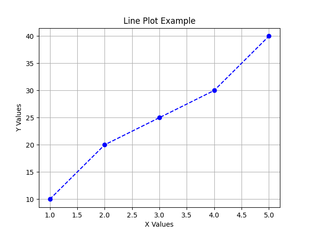
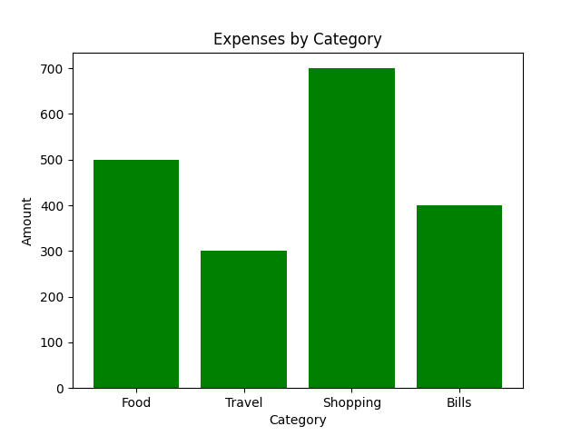
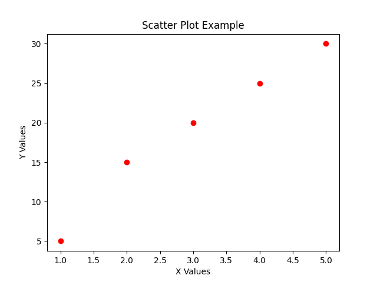
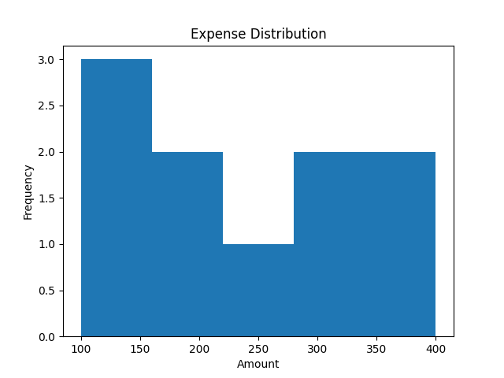
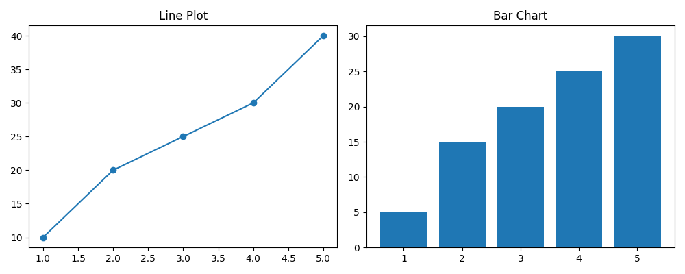

# Matplotlib Practice 📊

This repository contains basic data visualization examples using Matplotlib.

---

## 📌 Topics Covered

- Line Plot
- Bar Chart
- Scatter Plot
- Histogram
- Subplots

---

## 🧠 Concepts Used

- Data visualization
- Plot customization (title, labels, grid)
- Multiple plots handling
- Frequency distribution

---

## 📊 Sample Outputs

### 🔹 Line Plot

### 🔹 Bar Chart

### 🔹 Scatter Plot

### 🔹 Histogram

### 🔹 Subplots
